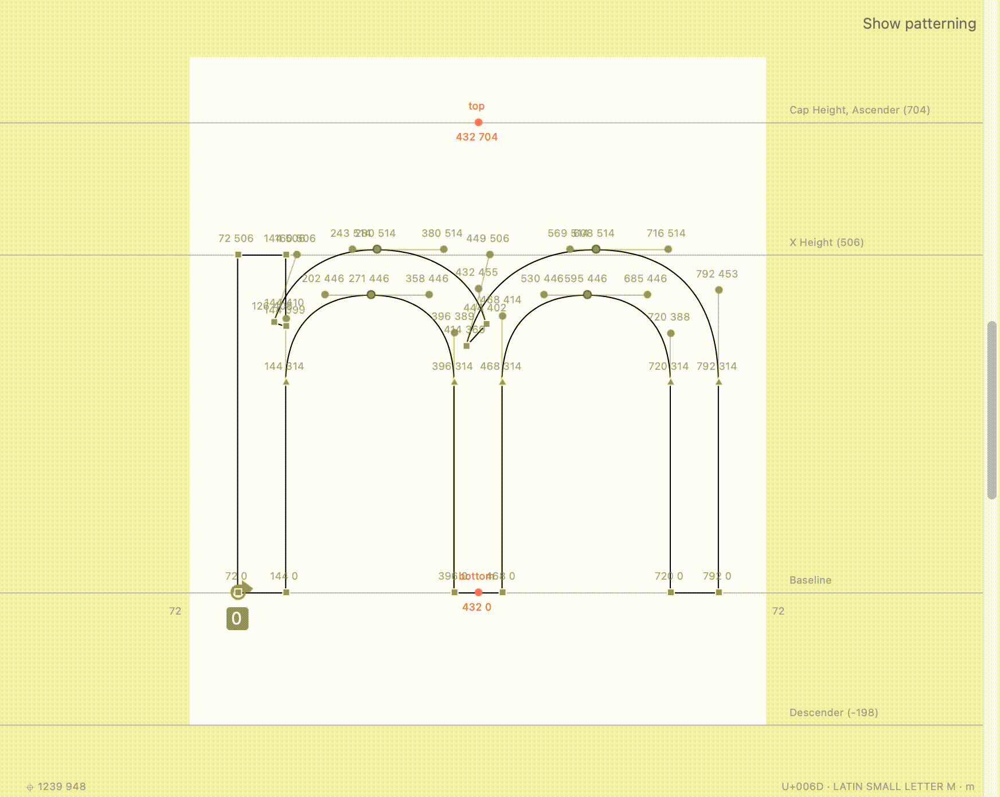

# Script to show patterning grid in RoboFont glyph editor

Adds a button to show grid. Signals red when margin values are not multiple to units.

It is usefull to set up as one of startup scripts.

